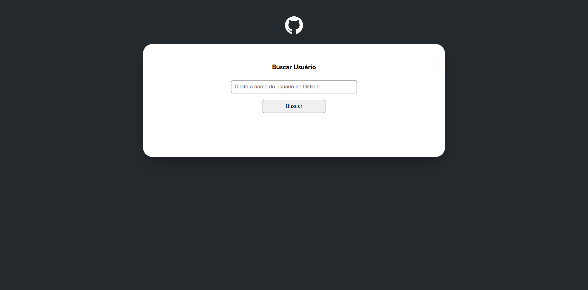

# 🌐 Projeto Mundo Real com Fetch e GitHub API

Uma aplicação que consome a [GitHub API](https://api.github.com) para buscar dados de um usuário a partir de um nome de usuário digitado. O projeto foi criado com HTML, CSS e JavaScript puro, com foco em praticar requisições assíncronas com `fetch`, manipulação de DOM e tratamento de erros.

🔗 **Acesse o projeto online:** [GitHub Pages](https://endriusssantos.github.io/projeto-mundo-real-com-fetch-e-github-api-main/)

---

## ✨ Funcionalidades

- 🔍 **Buscar Usuário do GitHub**: Insira um nome de usuário e visualize informações públicas diretamente da API.
- 📄 **Exibição de Dados**:
  - Nome
  - Avatar
  - Bio
  - Repositórios públicos
  - Seguidores e seguindo
- ❌ **Tratamento de Erros**: Mensagens amigáveis caso o usuário não seja encontrado ou em caso de erro na requisição.
- 📱 **Responsivo**: Interface adaptável para diferentes tamanhos de tela.
- 🎨 **Design Limpo**: Layout simples, com foco na legibilidade e experiência do usuário.

---

## 🛠️ Tecnologias Utilizadas

- **HTML5**
- **CSS3**
  - Layout com Flexbox
  - Responsividade
- **JavaScript (Vanilla)**
  - Requisições com `fetch`
  - Manipulação de DOM
  - Validações e tratamento de erros

---

## 🚀 Como Rodar o Projeto

1. Clone o repositório:

```bash
git clone https://github.com/endriusssantos/projeto-mundo-real-com-fetch-e-github-api-main
cd projeto-mundo-real-com-fetch-e-github-api-main
```

2. Abra o arquivo index.html em seu navegador, ou use uma extensão como "Live Server" no VSCode.

---

## 💡 Possíveis Melhorias Futuras

- 🗂️ Listagem de repositórios com links
- 📊 Exibir linguagens mais usadas
- 🔁 Histórico de pesquisas anteriores
- 🌙 Modo escuro

---

## 📸 Preview



---

## 🧑‍💻 Autor

Feito com 💙 por Endrius da Silva dos Santos
